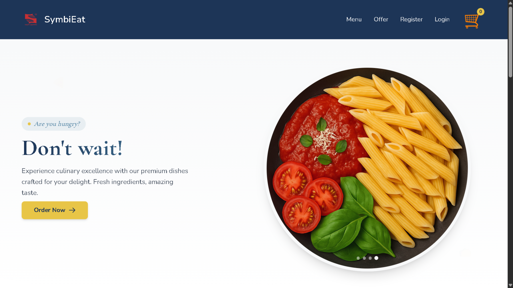
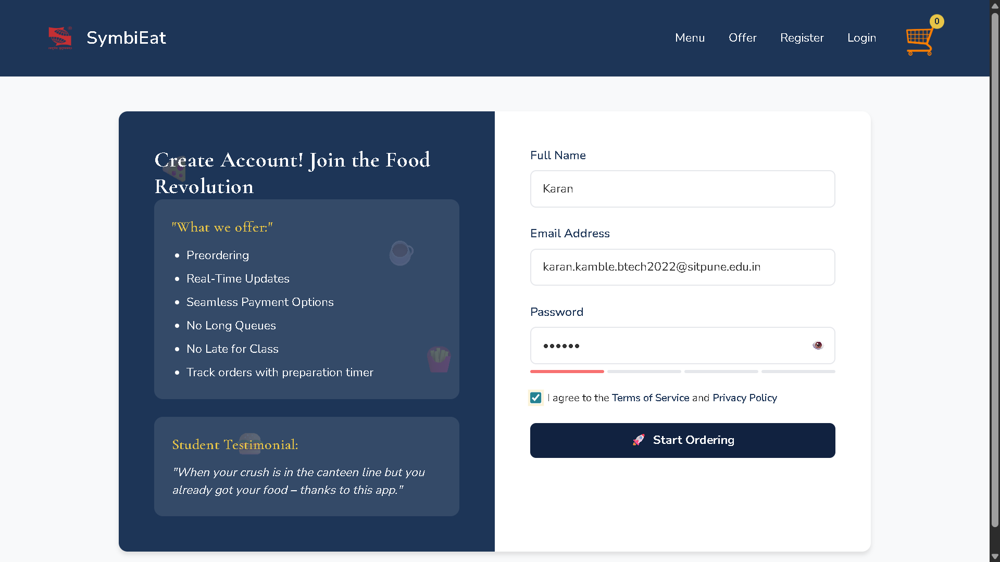
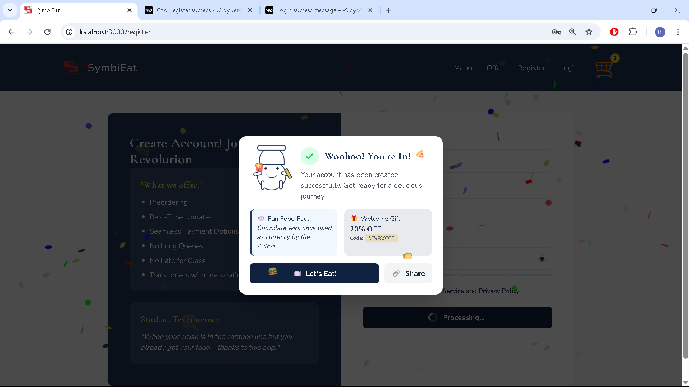
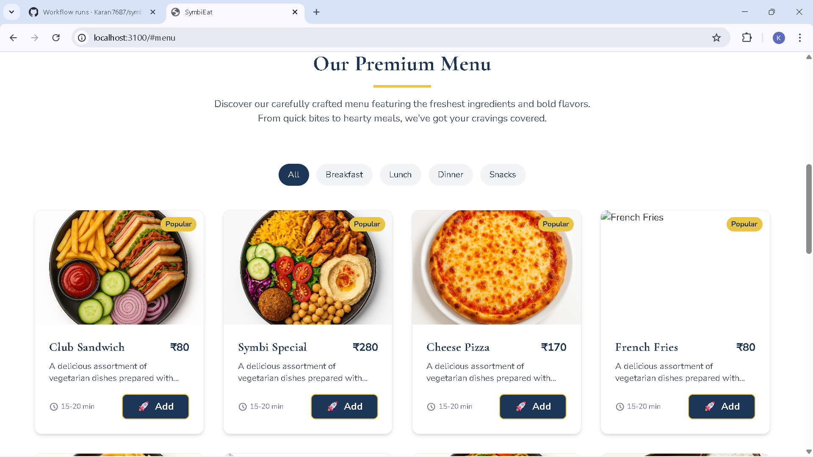
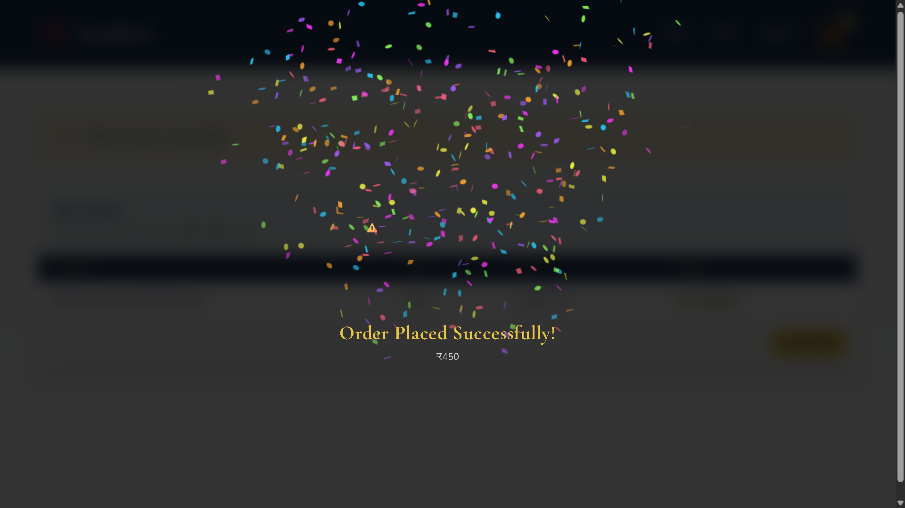
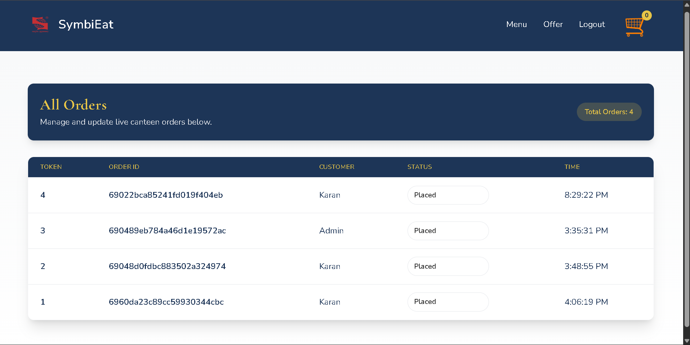

# 🍽️ SymbiEat – Smart Canteen Pre‑Ordering Platform

> **SymbiEat** is a full‑stack canteen pre‑ordering and order‑management platform designed for colleges. It eliminates long queues by allowing students to **pre‑order food**, **pay online**, and **track orders in real time**, while giving canteen admins a **live order management dashboard**.

---

## 🚀 Why SymbiEat?

* ⏱️ **No more waiting in long queues**
* 📱 **Seamless ordering experience for students**
* 🔔 **Real‑time order updates**
* 🧾 **Centralized admin panel for live order tracking**
* 💳 **Secure online payments**

Built with scalability, clean UI, and real‑world usability in mind.

---

## ✨ Key Features

### 👨‍🎓 Student / User Side

* 🔐 User authentication (Register / Login)
* 🍔 Browse a **categorized premium menu** (Breakfast, Lunch, Dinner, Snacks)
* ⭐ Highlighted **Popular items**
* 🛒 Add to cart & place orders with animations
* 💳 Secure online payment flow
* ⏳ Live order status & preparation time
* 🎉 Order success confirmation

### 🧑‍🍳 Admin Panel

* 📊 **Live dashboard showing all orders**
* 🔢 Auto‑generated order tokens
* 👤 View customer‑wise order details
* 🔄 Real‑time order status updates
* 🧾 Centralized order history

---
## 🖼️ Screenshots

### 🏠 Landing Page
Modern hero section with clear call-to-action and clean navigation.

---

### 🔐 User Registration
User-friendly registration form with validation and password strength indicator.

---

### 🍕 Sucessful Registration Celebration
A smooth and secure onboarding experience with real-time input validation.

### 🍕 Menu & Ordering
Category-based menu with popular tags, pricing, and add-to-cart actions.

---

### 🎉 Order Confirmation
Animated order success screen with total bill details.

---

### 🧑‍🍳 Admin Dashboard
Live admin panel displaying all orders with token number, customer, status, and time.

## 🛠️ Tech Stack

### Frontend

* **Next.js (App Router)**
* **React.js**
* **TypeScript**
* Tailwind CSS

### Backend

* **Node.js**
* **REST APIs**
* Authentication & authorization logic

### Database

* **MongoDB**
* **Mongoose**

### Payments & Storage

* **Razorpay** (Payment integration)
* **AWS S3** (Asset storage)

### Tools & Practices

* Git & GitHub
* Agile development workflow
* Modular & reusable component architecture

---

## 🧠 System Design Highlights

* Designed to support **high concurrent student usage** during peak hours
* Scalable API architecture
* Clean separation of user and admin flows
* Optimized database queries for faster order retrieval

---

## 🎯 Project Motivation

College canteens face two major problems:

1. Long queues during breaks
2. Poor order visibility for both students and staff

**SymbiEat** solves this by introducing a **digital, real‑time, and efficient canteen workflow** that benefits students, admins, and staff alike.

---

## 📌 Current Status

✅ Core features completed
🚧 Enhancements in progress (notifications, analytics, performance tuning)

---

## 👨‍💻 Author

**Karan Kamble**
B.Tech – Computer Science & Engineering
Symbiosis Institute of Technology, Pune

* GitHub: [https://github.com/Karan7687](https://github.com/Karan7687)
